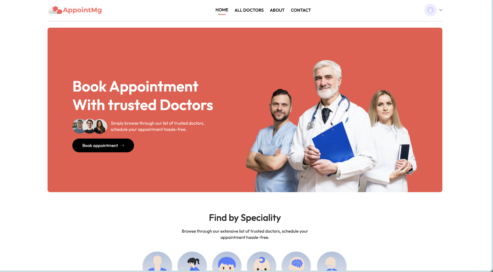
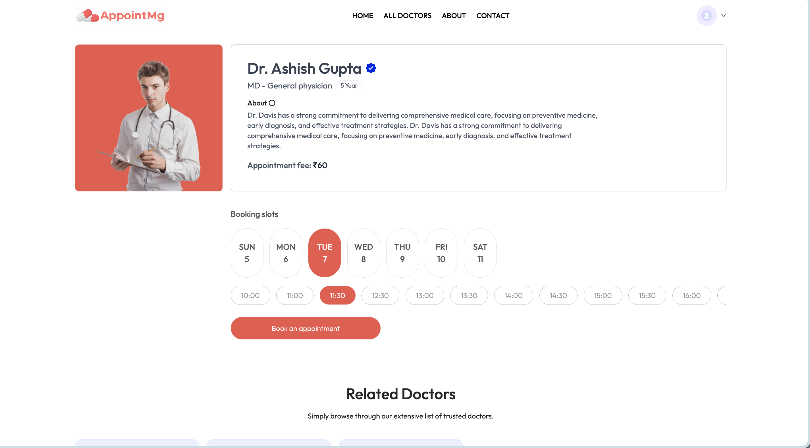
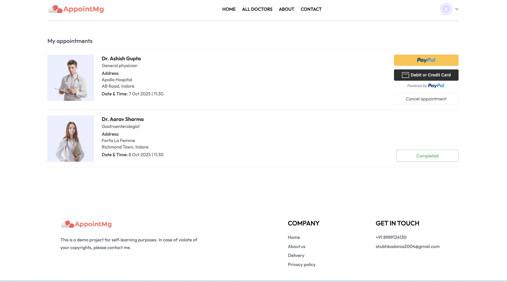
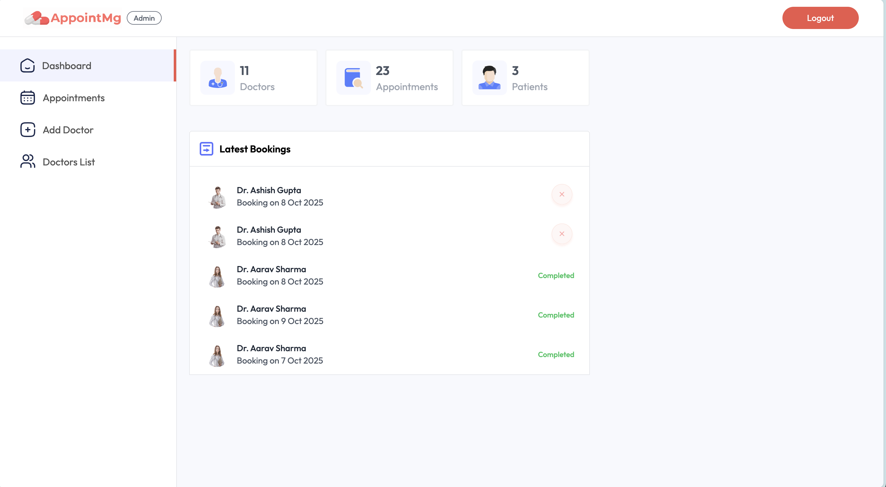
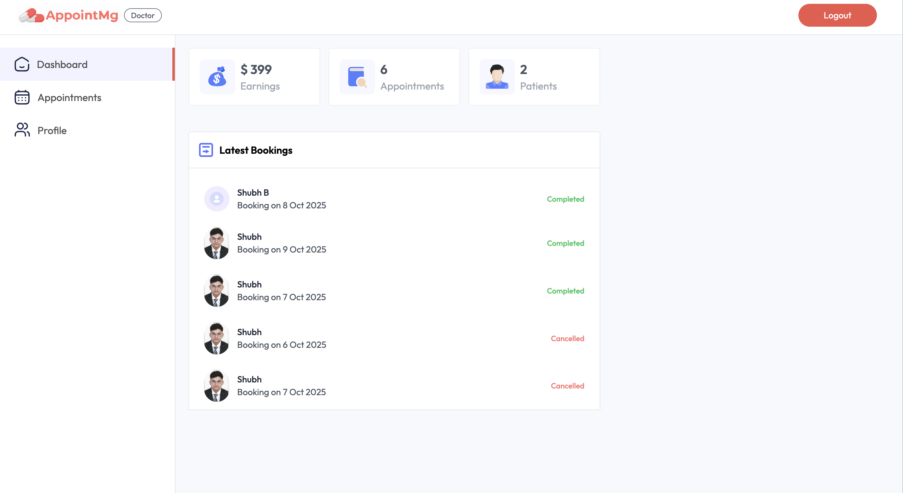

# Doctor Appointment App — MERN Stack Showcase

A complete doctor appointment application built with the **MERN Stack (MongoDB, Express, React, Node.js)**.

---

## 🎯 Major Focus

1. **New-age Design** — modern, minimal, and responsive interface  
2. **Ease of Use** — seamless navigation and clear workflows  
3. **Payment Integration** — secure and smooth checkout process  
4. **Independent 3-way Login** — separate portals for **Users**, **Doctors**, and **Admin**

---

## 🚀 Features Incorporated

1. **PayPal Payment Integration** — safe and verified online payments  
2. **Booking Slot Management** — real-time scheduling and availability tracking  
3. **Intuitive UI** — for booking, managing, and monitoring appointments  
4. **Token-based Authentication (JWT)** — secure login and session handling  
5. **Single Page Application (SPA)** — built for speed and a smooth user experience  

---

## 🛠️ Tech Stack

- **Frontend:** React (Vite), Tailwind CSS  
- **Backend:** Node.js, Express.js  
- **Database:** MongoDB  
- **Payments:** PayPal Smart Button Integration  

---

## 🌐 Live Links

- **User Frontend:** [Live URL](https://appointmg.netlify.app/)  
- **Admin Panel:** [Live URL](https://appointmg-admin.netlify.app/)  
- **Backend API:** [Live URL](https://appointmg-backend.onrender.com)  

---

## 🖼️ Screenshots

## 📁 Repositories
- [Frontend (Private)](https://github.com/shubhbadonia/appointmg-frontend)  
- [Admin (Private)](https://github.com/shubhbadonia/appointmg-admin)  
- [Backend (Private)](https://github.com/shubhbadonia/appointmg-backend)

> Private repos available upon request.
> Built with passion as a learning and showcase project to explore full-stack development with MERN.
